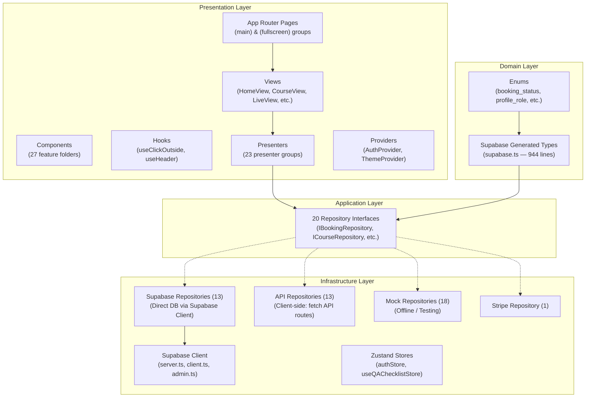
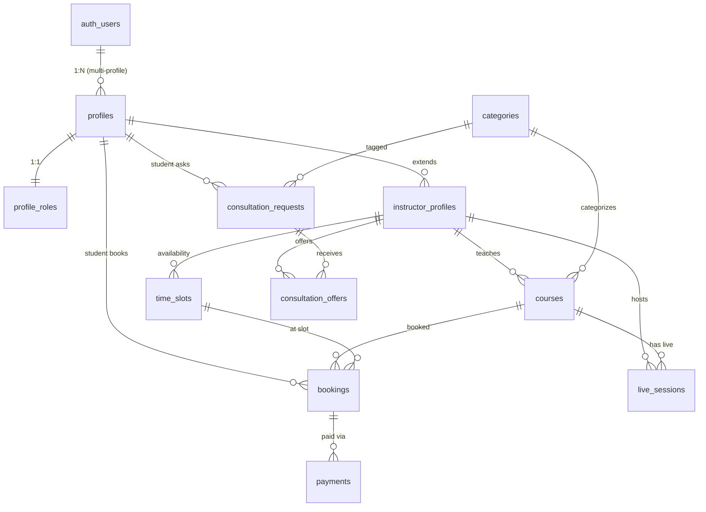
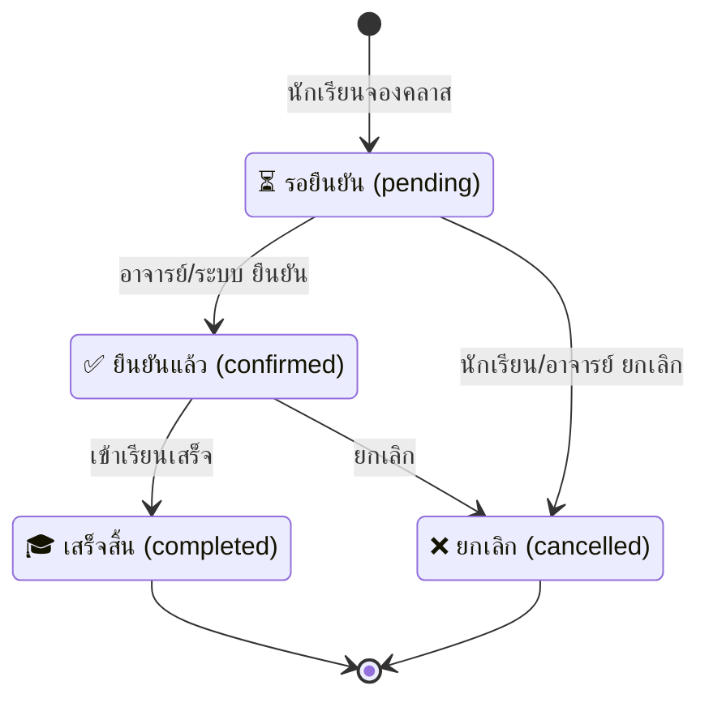
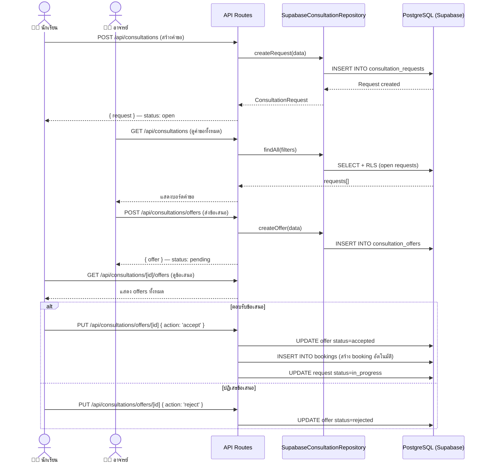
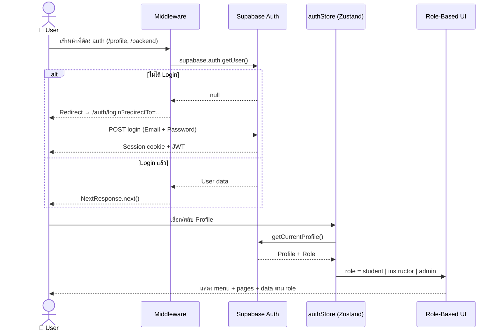
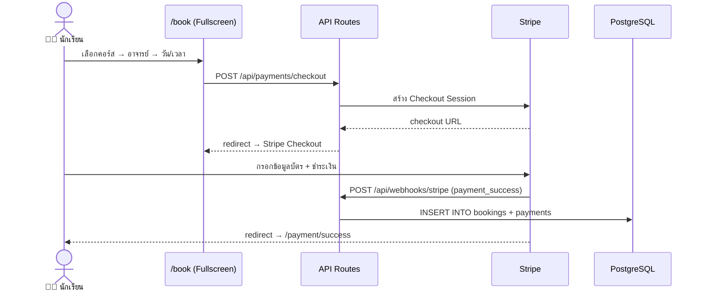
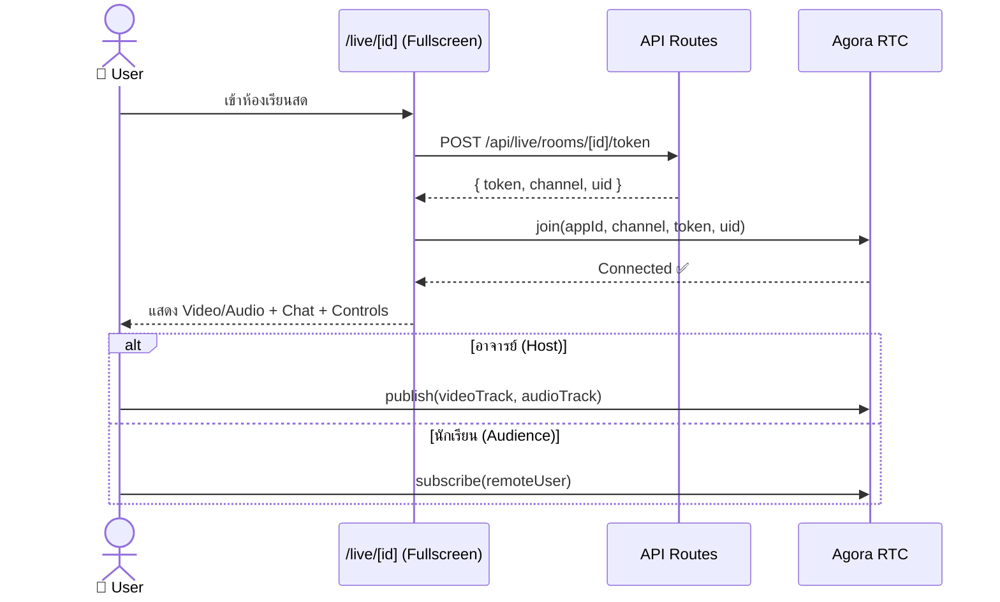
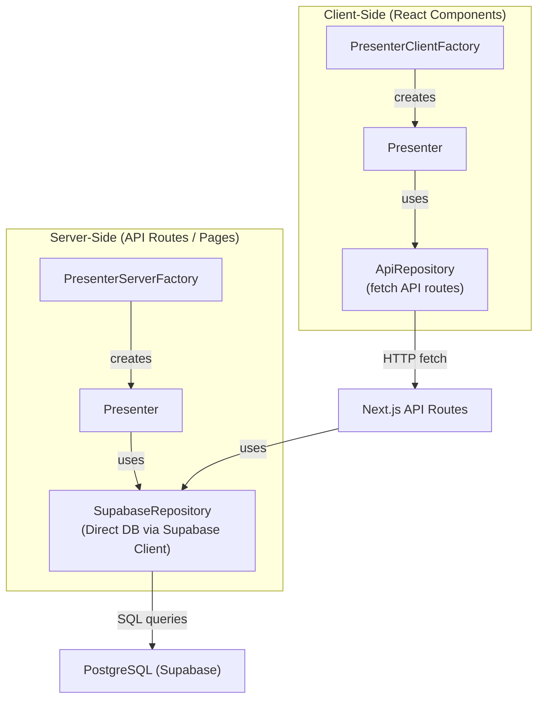

# Live Learning — AI Context & Workspace Tracking

## 📌 Project Overview

**Live Learning** คือแพลตฟอร์มเรียนสดออนไลน์ครบวงจร สร้างด้วย **Next.js 16 (App Router)** ตาม **Clean Architecture** อย่างเคร่งครัด

ระบบมี 3 บทบาทหลัก:
1. **นักเรียน (Student)** — ค้นหาคอร์ส, จองเรียน, เข้าห้องเรียนสด, โพสต์คำขอปรึกษา
2. **อาจารย์ (Instructor)** — สร้างคอร์ส, ตั้งตารางเวลา, สอนสด, รับงานจากบอร์ดปรึกษา
3. **ผู้ดูแลระบบ (Admin)** — จัดการผู้ใช้, คอร์ส, และระบบทั้งหมด

---

## 🛠 Tech Stack

| Category | Technology |
|---|---|
| **Core** | Next.js 16 (App Router + Turbopack), React 19, TypeScript 5 |
| **Styling** | Tailwind CSS v4, Glassmorphism, Custom CSS Variables |
| **State** | Zustand 5 (Auth store, QA Checklist store) |
| **Data Fetching** | TanStack React Query 5 |
| **Animations** | React Spring (Physics-based micro-animations) |
| **Database** | PostgreSQL via Supabase (Auth + Storage + RLS) |
| **Auth** | Supabase Auth (Email/Password, Multi-profile, RLS) |
| **Payments** | Stripe (Checkout Sessions, Webhooks) |
| **Live Video** | Agora RTC SDK (Video/Audio + Real-time Chat) |
| **Forms** | React Hook Form 7 + Zod 4 (Validation) |
| **Charts** | Recharts 3 |
| **Font** | Noto Sans Thai (Google Fonts) |
| **Others** | `dayjs` (Date), `qrcode.react` (QR Code), `nanoid` (ID), `next-themes` (Dark/Light), `sonner` (Toast), `next-intl` (i18n), `excalidraw` (Whiteboard), `react-player` (Video), `react-to-print` (Print), `html2canvas` (Screenshot), `prismjs` (Code Highlight), `@hello-pangea/dnd` (Drag & Drop), `resend` (Email), `clsx` (Classnames), `sharp` (Image) |

---

## 🏗 Architecture (Clean Architecture — 4 Layers)



### Layer Details

| Layer | Path | หน้าที่ |
|---|---|---|
| **Domain** | `src/domain/` | Supabase generated types (`supabase.ts`) — Entity definitions, Enums ไม่พึ่งพา framework ใดๆ |
| **Application** | `src/application/` | Repository interface definitions (20 interfaces) — กำหนด contract |
| **Infrastructure** | `src/infrastructure/` | Supabase client (server/client/admin), Repository implementations (Supabase, API, Mock, Stripe) |
| **Presentation** | `src/presentation/` | React components (27 groups), Presenters (23 groups), Hooks, Providers |

---

## ✨ Features ทั้งหมด

### 1. ระบบ Authentication & Profiles
- **สมัครสมาชิก / เข้าสู่ระบบ** — Email + Password ผ่าน Supabase Auth
- **Demo Login** — 1-click demo cards (Student / Instructor / Admin)
- **Multi-Profile** — รองรับหลายโปรไฟล์ต่อ 1 auth account
- **Role-Based Access** — `student` · `instructor` · `admin` — menu, page, data ปรับตาม role
- **ลืมรหัสผ่าน / รีเซ็ตรหัสผ่าน** — ผ่าน Supabase Auth email flow
- **Row Level Security (RLS)** — RLS policies ทุกตาราง ป้องกัน data leak
- **Middleware Protection** — Next.js middleware ตรวจ session + redirect เส้นทางที่ต้อง auth (`/backend`, `/profile`)
- **Configurable Auth Methods** — เปิด/ปิด OAuth, Phone OTP, Registration ผ่าน env variables

### 2. ระบบคอร์สเรียน (Course Catalog)
- **แคตตาล็อกคอร์ส** — ค้นหา, กรอง, browse คอร์สทั้งหมด
- **รายละเอียดคอร์ส** — ข้อมูลครบ: ราคา, rating, จำนวนนักเรียน, อาจารย์
- **กรองตามหมวดหมู่** — 6 หมวด: Web Dev · Data Science & AI · Design · Mobile · Cybersecurity · DevOps
- **Featured Courses** — คอร์สแนะนำบนหน้าแรก

### 3. ระบบอาจารย์ (Instructor System)
- **Instructor Directory** — ลิสต์อาจารย์พร้อม rating, specializations
- **Instructor Profile** — Bio, ภาษา, hourly rate, จำนวนนักเรียน
- **Time Slots** — ตารางเวลาว่างรายสัปดาห์ (day + time)
- **Online Status** — แสดงสถานะออนไลน์/ออฟไลน์

### 4. ระบบจองเรียน (Booking System)
- **จองคลาส** — เลือกคอร์ส → อาจารย์ → วัน/เวลา → ยืนยัน
- **สถานะ Booking** — `pending` → `confirmed` → `completed` / `cancelled`
- **My Bookings** — หน้ารวม booking ของ student
- **Schedule View** — หน้าตารางสอนของ instructor

### 5. ระบบเรียนสด (Live Sessions)
- **Session List** — รายการ live กำลังถ่ายทอด + กำหนดการ
- **Live Room** — Video/Audio ผ่าน Agora RTC + Real-time Chat + Viewer count
- **Controls** — Mic/Camera toggle, Leave confirmation modal
- **Fullscreen Layout** — ใช้ `(fullscreen)` route group แยกจาก main layout

### 6. ระบบขอคำปรึกษา (Consultation Requests)
- **Post Request** — นักเรียนโพสต์หัวข้อที่อยากปรึกษา + เวลาที่สะดวก + งบ
- **Offer Board** — อาจารย์เรียกดูคำขอทั้งหมด filter ตาม category
- **Submit Offer** — อาจารย์ส่งข้อเสนอ (ราคา + เวลา + message)
- **Accept & Book** — นักเรียนเลือกข้อเสนอ → Booking ถูกสร้างอัตโนมัติ

### 7. ระบบชำระเงิน (Payments)
- **Stripe Integration** — Checkout Sessions สำหรับจ่ายเงิน
- **Webhook** — รับแจ้งการจ่ายเงินจาก Stripe
- **Payment Status** — หน้าแสดงผลสถานะการชำระ

### 8. ระบบ Enrollment
- **ลงทะเบียนเรียน** — ระบบ enrollment แยกจาก booking
- **ตรวจสอบสถานะ** — เช็คว่าลงทะเบียนแล้วหรือยัง

### 9. UI/UX & Design System
- **Role-Based Navigation** — Student / Instructor / Guest เห็น menu ต่างกัน
- **Dark/Light Mode** — รองรับ Dark/Light ผ่าน `next-themes`
- **Glassmorphism** — Design system ที่ใช้ทั่วทั้งแอป
- **Decorative Background Orbs** — พื้นหลังแบบ animated gradient orbs
- **React Spring Animations** — AnimatedButton, AnimatedCard, FloatingElement, GlowOrb
- **Responsive Design** — Mobile + Desktop
- **Noto Sans Thai Font** — ฟอนต์ภาษาไทยจาก Google Fonts

### 10. อื่นๆ
- **Blog** — หน้าบทความ
- **Events** — หน้ากิจกรรม
- **FAQ** — คำถามที่พบบ่อย
- **Feedback** — ระบบส่ง feedback
- **Achievements** — ความสำเร็จและ badges
- **Support** — หน้าช่วยเหลือ
- **Discord** — ลิงก์ชุมชน Discord
- **Privacy & Terms** — หน้านโยบายความเป็นส่วนตัวและข้อกำหนด
- **Settings** — ตั้งค่าโปรไฟล์, รหัสผ่าน, preferences
- **QA Checklist** — ระบบ checklist สำหรับ QA testing

---

## 🗄 Database Schema

ใช้ **PostgreSQL** ผ่าน **Supabase** (Local dev + Cloud production) พร้อม **Row Level Security (RLS)**



### Tables (11+)

| Table | Purpose |
|---|---|
| `profiles` | User profiles (extends auth.users), 1:N multi-profile per auth user |
| `profile_roles` | Role assignment: `student` / `instructor` / `admin` |
| `categories` | 6 หมวดหมู่คอร์ส: Web · AI · Design · Mobile · Security · DevOps |
| `instructor_profiles` | ข้อมูลอาจารย์: bio, rating, hourly_rate, specializations |
| `courses` | Course catalog: ชื่อ, ราคา, rating, tags |
| `time_slots` | ตารางเวลาว่างรายสัปดาห์ของอาจารย์ (day + time) |
| `bookings` | การจองเรียน: student ↔ instructor ↔ course ↔ time slot |
| `payments` | ข้อมูลการชำระเงิน (Stripe) |
| `live_sessions` | Live streaming sessions: status (`scheduled` / `live` / `ended`) |
| `consultation_requests` | คำขอปรึกษาจากนักเรียน: title, description, level, budget, preferred dates/times |
| `consultation_offers` | ข้อเสนอจากอาจารย์: message, offered_price, offered_date/time, status |

### Enums (Supabase Generated)

| Enum | Values |
|---|---|
| `booking_status` | `pending`, `confirmed`, `completed`, `cancelled` |
| `consultation_offer_status` | `pending`, `accepted`, `rejected`, `withdrawn` |
| `consultation_request_status` | `open`, `in_progress`, `closed`, `cancelled` |
| `live_session_status` | `scheduled`, `live`, `ended` |
| `profile_role` | `student`, `instructor`, `admin` |

### Migrations (9 files)

| Migration | หน้าที่ |
|---|---|
| `20250618000000_initial_schema.sql` | Schema เริ่มต้น (profiles, roles) |
| `20250618000001_security_policies.sql` | RLS Policies |
| `20250618000002_api_functions.sql` | Database functions |
| `20250618000003_storage.sql` | Storage buckets & policies |
| `20250619000001_profile_functions.sql` | Profile helper functions |
| `20250811000000_backend_user_functions.sql` | Backend user management |
| `20260212000000_live_learning_schema.sql` | Core schema: courses, instructors, time_slots, bookings, live_sessions |
| `20260213000000_consultation_requests.sql` | Consultation requests & offers |
| `20260216000000_add_payments.sql` | Payments table |

### Seeds (4 files)

| Seed | หน้าที่ |
|---|---|
| `000-init_seed.sql` | สร้าง auth users เริ่มต้น (admin, instructor, student) |
| `001-master_seed.sql` | Master data (categories, etc.) |
| `002-starter_content.sql` | เนื้อหาเริ่มต้น (courses, instructors, etc.) |
| `003-mock_seed.sql` | Mock data สำหรับ development |

---

## 🔌 API Routes

### Auth (Supabase Auth — handled via middleware + client)

| Route | Auth | หน้าที่ |
|---|---|---|
| `/auth/login` | ❌ | หน้า Login (Fullscreen) |
| `/auth/register` | ❌ | หน้าสมัครสมาชิก (Fullscreen) |
| `/auth/forgot-password` | ❌ | หน้าลืมรหัสผ่าน |
| `/auth/reset-password` | ❌ | หน้ารีเซ็ตรหัสผ่าน |

### Profiles Routes

| Method | Route | Auth | หน้าที่ |
|---|---|---|---|
| GET | `/api/profiles` | ❌ | ดึงรายการ profiles |
| GET | `/api/profiles/me` | ✅ | ดึง profile ปัจจุบัน |
| GET | `/api/profiles/[id]` | ❌ | ดึง profile ตาม ID |
| PUT | `/api/profiles/[id]` | ✅ | อัปเดต profile |
| GET | `/api/profiles/stats` | ❌ | สถิติ profiles |
| POST | `/api/profiles/switch` | ✅ | สลับ profile |

### Courses Routes

| Method | Route | Auth | หน้าที่ |
|---|---|---|---|
| GET | `/api/courses` | ❌ | ดึงรายการคอร์ส (browse, search, filter) |
| GET | `/api/courses/[id]` | ❌ | ดึงรายละเอียดคอร์ส |
| GET | `/api/courses/instructor` | ✅ | ดึงคอร์สของอาจารย์ |
| GET | `/api/courses/stats` | ❌ | สถิติคอร์ส |

### Instructors Routes

| Method | Route | Auth | หน้าที่ |
|---|---|---|---|
| GET | `/api/instructors` | ❌ | ดึงรายการอาจารย์ |
| GET | `/api/instructors/[id]` | ❌ | ดึง profile อาจารย์ |
| GET | `/api/instructors/[id]/time-slots` | ❌ | ดึง time slots |
| GET | `/api/instructors/me` | ✅ | ดึง instructor profile ตัวเอง |
| GET | `/api/instructors/stats` | ❌ | สถิติอาจารย์ |

### Bookings Routes

| Method | Route | Auth | หน้าที่ |
|---|---|---|---|
| GET | `/api/bookings` | ✅ | ดึงรายการ bookings |
| GET | `/api/bookings/[id]` | ✅ | ดึง booking ตาม ID |
| GET | `/api/bookings/instructors` | ✅ | ดึง bookings ของอาจารย์ (Schedule) |
| GET | `/api/bookings/students` | ✅ | ดึง bookings ของนักเรียน (My Bookings) |
| GET | `/api/bookings/stats` | ✅ | สถิติ bookings |

### Consultations Routes

| Method | Route | Auth | หน้าที่ |
|---|---|---|---|
| GET/POST | `/api/consultations` | ✅ | ดึง/สร้าง consultation requests |
| GET/PUT | `/api/consultations/[id]` | ✅ | ดึง/อัปเดต request ตาม ID |
| GET | `/api/consultations/[id]/offers` | ✅ | ดึง offers ของ request |
| GET | `/api/consultations/student` | ✅ | ดึง requests ของนักเรียน |
| GET | `/api/consultations/stats` | ✅ | สถิติ consultations |
| GET | `/api/consultations/offers` | ✅ | ดึงรายการ offers ทั้งหมด |
| POST | `/api/consultations/offers` | ✅ | สร้าง offer ใหม่ |
| GET | `/api/consultations/offers/[id]` | ✅ | ดึง offer ตาม ID |
| PUT | `/api/consultations/offers/[id]` | ✅ | อัปเดต offer (accept/reject) |
| GET | `/api/consultations/offers/instructor` | ✅ | ดึง offers ของอาจารย์ |

### Categories Routes

| Method | Route | Auth | หน้าที่ |
|---|---|---|---|
| GET | `/api/categories` | ❌ | ดึง categories ทั้งหมด |
| GET | `/api/categories/[id]` | ❌ | ดึง category ตาม ID |
| GET | `/api/categories/stats` | ❌ | สถิติ categories |

### Live Sessions Routes

| Method | Route | Auth | หน้าที่ |
|---|---|---|---|
| GET | `/api/live/rooms` | ❌ | ดึงรายการ live rooms |
| GET | `/api/live/rooms/[id]` | ✅ | ดึง live room ตาม ID |
| POST | `/api/live/rooms/[id]/token` | ✅ | สร้าง Agora token สำหรับเข้า room |

### Enrollments Routes

| Method | Route | Auth | หน้าที่ |
|---|---|---|---|
| GET/POST | `/api/enrollments` | ✅ | ดึง/สร้าง enrollments |
| GET | `/api/enrollments/check` | ✅ | ตรวจสอบว่า enroll แล้วหรือยัง |

### Payments Routes

| Method | Route | Auth | หน้าที่ |
|---|---|---|---|
| POST | `/api/payments/checkout` | ✅ | สร้าง Stripe checkout session |

### Settings Routes

| Method | Route | Auth | หน้าที่ |
|---|---|---|---|
| PUT | `/api/settings/password` | ✅ | เปลี่ยนรหัสผ่าน |
| GET/PUT | `/api/settings/preferences` | ✅ | จัดการ preferences |
| GET/PUT | `/api/settings/profile` | ✅ | จัดการ profile settings |

### Stripe Routes

| Method | Route | Auth | หน้าที่ |
|---|---|---|---|
| POST | `/api/stripe/construct-event` | ❌ | Construct Stripe event |

### Webhooks Routes

| Method | Route | Auth | หน้าที่ |
|---|---|---|---|
| POST | `/api/webhooks/stripe` | ❌ | Webhook endpoint สำหรับ Stripe events |

---

## 🔄 Workflow Diagrams

### Flow 1: Booking Lifecycle (สถานะการจอง)



### Flow 2: Consultation Request Flow (ระบบขอคำปรึกษา)



### Flow 3: Authentication & Role-Based Access



### Flow 4: Booking Flow (จองเรียน)



### Flow 5: Live Session Flow (เรียนสด)



### Flow 6: Repository Pattern (Dependency Injection)



---

## 📁 Directory Structure

```
live-learning-nextjs/
├── app/                                    # Next.js App Router
│   ├── layout.tsx                          # Root layout + AuthProvider + ThemeProvider
│   ├── (main)/                             # Main layout (Header + Footer + Background Orbs)
│   │   ├── layout.tsx                      # MainGroupLayout (Header, Footer, decorative orbs)
│   │   ├── page.tsx                        # Home page (Server Component)
│   │   ├── loading.tsx                     # Global loading skeleton
│   │   ├── achievements/                   # Achievements page
│   │   ├── blog/                           # Blog page
│   │   ├── categories/                     # Category browser + detail
│   │   ├── consultations/                  # Consultation requests + board + detail
│   │   ├── courses/                        # Course catalog + detail
│   │   ├── discord/                        # Discord community link
│   │   ├── events/                         # Events page
│   │   ├── faq/                            # FAQ page
│   │   ├── feedback/                       # Feedback page
│   │   ├── instructors/                    # Instructor listing + profile detail
│   │   ├── live/                           # Live sessions list
│   │   ├── my-bookings/                    # Student bookings
│   │   ├── payment/                        # Payment status pages
│   │   ├── privacy/                        # Privacy policy
│   │   ├── profile/                        # User profile
│   │   ├── schedule/                       # Instructor schedule
│   │   ├── settings/                       # Settings (profile, password, preferences)
│   │   ├── support/                        # Support page
│   │   └── terms/                          # Terms of service
│   ├── (fullscreen)/                       # Fullscreen layout (no Header/Footer)
│   │   ├── layout.tsx                      # Minimal layout
│   │   ├── auth/                           # Login, Register, Forgot/Reset password
│   │   ├── book/                           # Booking flow (wizard)
│   │   └── live/                           # Live room (video + chat)
│   ├── api/                                # API Routes
│   │   ├── bookings/                       # Booking CRUD + stats
│   │   ├── categories/                     # Category CRUD + stats
│   │   ├── consultations/                  # Consultation requests + offers
│   │   ├── courses/                        # Course CRUD + stats
│   │   ├── enrollments/                    # Enrollment management
│   │   ├── instructors/                    # Instructor listing + detail
│   │   ├── live/                           # Live rooms + token generation
│   │   ├── payments/                       # Stripe checkout session
│   │   ├── profiles/                       # Profile CRUD + switch
│   │   ├── settings/                       # Password, preferences, profile
│   │   ├── stripe/                         # Stripe event construction
│   │   └── webhooks/                       # Stripe webhook handler
│   └── qa-checklist/                       # QA checklist page
├── src/
│   ├── domain/
│   │   └── types/
│   │       └── supabase.ts                 # Supabase-generated TypeScript types (944 lines)
│   ├── application/
│   │   └── repositories/                   # 20 Repository Interfaces
│   │       ├── IAchievementRepository.ts
│   │       ├── IAuthRepository.ts
│   │       ├── IBlogRepository.ts
│   │       ├── IBookingRepository.ts
│   │       ├── IBookingWizardRepository.ts
│   │       ├── ICategoryRepository.ts
│   │       ├── IConfigRepository.ts
│   │       ├── IConsultationRepository.ts
│   │       ├── IContentRepository.ts
│   │       ├── ICourseRepository.ts
│   │       ├── IEnrollmentRepository.ts
│   │       ├── IEventRepository.ts
│   │       ├── IFAQRepository.ts
│   │       ├── IFeedbackRepository.ts
│   │       ├── IInstructorRepository.ts
│   │       ├── ILiveRoomRepository.ts
│   │       ├── IPaymentRepository.ts
│   │       ├── IProfileRepository.ts
│   │       ├── ISettingsRepository.ts
│   │       └── IStripeRepository.ts
│   ├── infrastructure/
│   │   ├── supabase/                       # Supabase client setup
│   │   │   ├── server.ts                   # Server-side Supabase client
│   │   │   ├── client.ts                   # Client-side Supabase client
│   │   │   └── admin.ts                    # Admin Supabase client (service_role)
│   │   └── repositories/
│   │       ├── supabase/                   # 13 Supabase implementations (direct DB)
│   │       ├── api/                        # 13 API implementations (fetch API routes)
│   │       ├── mock/                       # 18 Mock implementations (offline/testing)
│   │       └── stripe/                     # 1 Stripe implementation
│   ├── presentation/
│   │   ├── hooks/
│   │   │   └── useClickOutside.ts          # Click outside detection hook
│   │   ├── providers/
│   │   │   ├── AuthProvider.tsx            # Auth context provider
│   │   │   └── ThemeProvider.tsx            # next-themes provider
│   │   ├── presenters/                     # 23 Presenter groups
│   │   │   ├── home/                       # HomePresenter + Server/Client factories
│   │   │   ├── courses/                    # CoursesPresenter
│   │   │   ├── course-detail/              # CourseDetailPresenter
│   │   │   ├── instructors/                # InstructorsPresenter
│   │   │   ├── instructor-detail/          # InstructorDetailPresenter
│   │   │   ├── booking/                    # BookingPresenter
│   │   │   ├── my-bookings/                # MyBookingsPresenter
│   │   │   ├── schedule/                   # SchedulePresenter
│   │   │   ├── live/                       # LivePresenter
│   │   │   ├── consultations/              # ConsultationsPresenter
│   │   │   ├── consultation-board/         # ConsultationBoardPresenter
│   │   │   ├── categories/                 # CategoriesPresenter
│   │   │   ├── payment/                    # PaymentPresenter
│   │   │   ├── profile/                    # ProfilePresenter
│   │   │   ├── settings/                   # SettingsPresenter
│   │   │   ├── config/                     # ConfigPresenter
│   │   │   ├── feedback/                   # FeedbackPresenter
│   │   │   ├── faq/                        # FAQPresenter
│   │   │   ├── blog/                       # BlogPresenter
│   │   │   ├── events/                     # EventsPresenter
│   │   │   ├── achievements/               # AchievementsPresenter
│   │   │   ├── content/                    # ContentPresenter
│   │   │   └── stripe/                     # StripePresenter
│   │   └── components/                     # 27 Component groups
│   │       ├── common/                     # AnimatedButton, AnimatedCard, FloatingElement, GlowOrb, etc.
│   │       ├── layout/                     # Header, Footer, MainLayout
│   │       ├── ui/                         # Base UI components
│   │       ├── auth/                       # Auth forms (Login, Register, etc.)
│   │       ├── home/                       # HomeView + sub-components
│   │       ├── courses/                    # Course list components
│   │       ├── course-detail/              # Course detail components
│   │       ├── instructors/                # Instructor list components
│   │       ├── instructor-detail/          # Instructor detail components
│   │       ├── booking/                    # Booking wizard components
│   │       ├── my-bookings/                # My bookings components
│   │       ├── schedule/                   # Schedule components
│   │       ├── live/                        # Live room components
│   │       ├── consultations/              # Consultation request components
│   │       ├── consultation-board/         # Consultation board components
│   │       ├── categories/                 # Category browser components
│   │       ├── payment/                    # Payment status components
│   │       ├── dashboard/                  # Dashboard components (role-based)
│   │       ├── profile/                    # Profile components
│   │       ├── settings/                   # Settings components
│   │       ├── feedback/                   # Feedback components
│   │       ├── faq/                        # FAQ components
│   │       ├── blog/                       # Blog components
│   │       ├── events/                     # Events components
│   │       ├── achievements/               # Achievements components
│   │       ├── content/                    # Content components
│   │       └── support/                    # Support components
│   └── stores/
│       ├── authStore.ts                    # Auth state (user, session, profile, role)
│       └── useQAChecklistStore.ts          # QA checklist state
├── middleware.ts                            # Auth middleware (Supabase session refresh + route protection)
├── supabase/
│   ├── config.toml                         # Local dev configuration
│   ├── migrations/                         # 9 SQL migration files
│   └── seeds/                              # 4 SQL seed files
├── public/
│   └── styles/                             # Global CSS
└── scripts/                                # Deploy & setup scripts
    ├── deploy-vercel.sh
    ├── deploy-supabase.sh
    ├── deploy-all.sh
    ├── setup-env.sh
    └── test-api.ts
```

---

## 📝 Context for AI (Continuity)

1. **Clean Architecture** — ห้ามข้ามชั้น layer โดยตรง (เช่น Presentation ห้ามเรียก Supabase DB) ต้องผ่าน Repository interface เสมอ
2. **Presenter Pattern** — ทุกหน้ามี Presenter + ServerFactory + ClientFactory — Server-side สร้าง `initialViewModel` ส่งผ่าน Server Component, Client-side ใช้ `usePresenter` hook
3. **Server vs Client** — Pages เป็น Server Components, Views เป็น Client Components ที่รับ `initialViewModel` จาก server
4. **Repository Factory** — Server-side ใช้ `SupabaseRepository` (direct DB via Supabase client), Client-side ใช้ `ApiRepository` (fetch API routes)
5. **Auth** — ใช้ Supabase Auth (Email/Password) + Multi-profile + RLS, session refresh ผ่าน middleware, auth state จัดการใน `authStore` (Zustand)
6. **DB** — ใช้ Supabase (PostgreSQL): Dev ผ่าน `supabase start` (local Docker), Production ผ่าน Supabase Cloud
7. **Role-Based Access** — 3 roles: `student`, `instructor`, `admin` — UI, menu, data ปรับตาม role ผ่าน `profile_roles` table
8. **Route Groups** — `(main)` group มี Header/Footer, `(fullscreen)` group เป็น minimal layout สำหรับ auth, booking wizard, live room
9. **Payments** — Stripe Checkout Sessions + Webhook → สร้าง booking + payment record อัตโนมัติ
10. **Live Sessions** — Agora RTC SDK: Host publish video/audio, Audience subscribe — Token สร้างผ่าน API route
11. **Consultation System** — กลับทิศจาก booking: นักเรียนโพสต์คำขอ → อาจารย์เสนอ → นักเรียนเลือก → Booking สร้างอัตโนมัติ
12. **Styling** — Tailwind CSS v4 + CSS Variables + Glassmorphism design system + React Spring animations
13. **i18n** — `next-intl` สำหรับ internationalization (ภาษาไทยเป็นหลัก)
14. **Deploy** — Frontend: Vercel, Backend: Supabase Cloud — มี deploy scripts พร้อม (`yarn deploy:all`)
