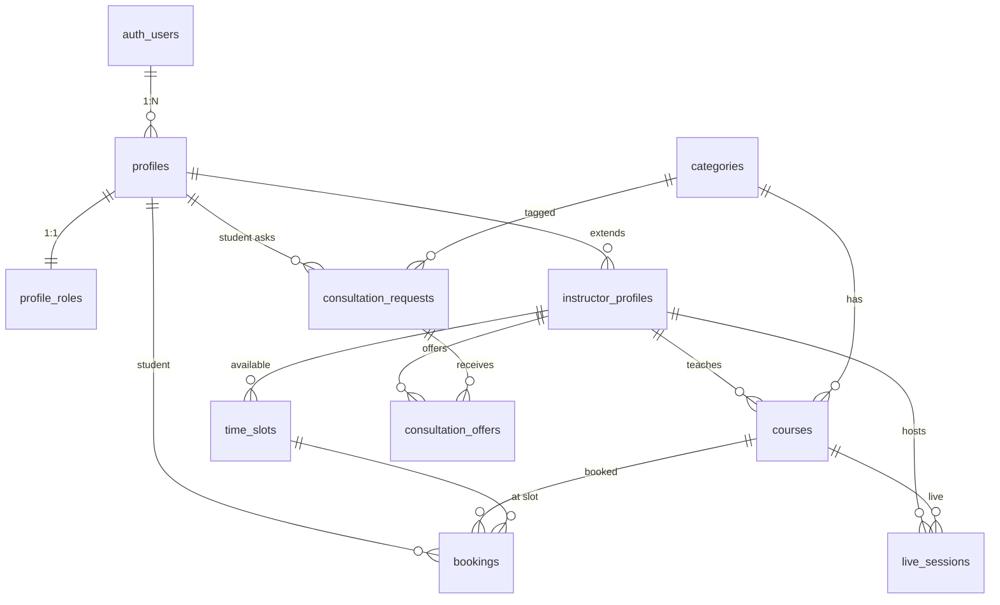

# Live Learning — Feature Documentation

> แพลตฟอร์มเรียนสดออนไลน์ พร้อมระบบจอง ปรึกษา และ Live Session

---

## 🏗️ สถาปัตยกรรม (Architecture)

```
Clean Architecture (4 Layers)
├── Presentation   → React Components, Views, Hooks
├── Application    → Repository Interfaces, Use Cases
├── Infrastructure → Mock/Supabase Repository Implementations
└── Domain         → Types, Entities
```

**Tech Stack:** Next.js 16 · React 19 · TypeScript · Zustand · Supabase · Tailwind CSS

---

## ✅ ฟีเจอร์ที่เสร็จแล้ว (Implemented Features)

### 🔐 Authentication & Profiles
- สมัครสมาชิก / เข้าสู่ระบบ (Email + Password)
- ลืมรหัสผ่าน / รีเซ็ตรหัสผ่าน
- Demo login cards (Student / Instructor / Admin)
- Multi-profile per auth user (รองรับหลายโปรไฟล์ต่อ 1 acccount)
- Role-based access: **Student** · **Instructor** · **Admin**

### 📚 Course Management
- แคตตาล็อกคอร์สทั้งหมด (browse, search, filter)
- รายละเอียดคอร์สพร้อม tags, rating, ราคา
- กรองตามหมวดหมู่ (6 categories)
- Featured courses บนหน้าแรก

### 👨‍🏫 Instructor System
- ลิสต์อาจารย์ผู้สอนทั้งหมดพร้อม rating, specialization
- โปรไฟล์อาจารย์ (bio, ภาษา, hourly rate)
- Time Slot availability (ตารางเวลาว่าง)
- แสดงสถานะ online / offline

### 📅 Booking System
- นักเรียนจองคลาสกับอาจารย์ (เลือกคอร์ส → เวลา → ยืนยัน)
- สถานะ booking: pending → confirmed → completed / cancelled
- หน้า "การจองของฉัน (My Bookings)" สำหรับ student
- หน้า "ตารางสอน (Schedule)" สำหรับ instructor

### 🔴 Live Sessions
- รายการ Live Sessions (กำลังสอน + กำหนดการ)
- ห้องสอนสด (Live Room) พร้อม:
  - Video/Audio controls (mic, camera)
  - Chat แบบ Real-time
  - Viewer count
  - Leave confirmation modal

### 🎨 UI/UX
- Role-based navigation (Student / Instructor / Guest แต่ละ role เห็น menu ต่างกัน)
- Role-aware profile page (stat + quick links ตาม role)
- Responsive design (Mobile + Desktop)
- Dark mode support
- Glassmorphism design system

### 🗂️ Categories
- 6 หมวดหมู่: Web Dev · Data Science & AI · Design · Mobile · Cybersecurity · DevOps

---

## 🆕 ฟีเจอร์ใหม่: ระบบขอคำปรึกษา (Consultation Requests)

### แนวคิด (Concept)
ในระบบเดิม **นักเรียน** ต้องรู้ก่อนว่าอยากเรียนกับอาจารย์ท่านไหน แล้วจึงไปจอง
แต่ในหลายกรณี นักเรียน **มีเรื่องอยากปรึกษาแต่ไม่รู้ว่าอาจารย์ท่านไหนว่าง/เหมาะสม**

ฟีเจอร์ใหม่นี้กลับทิศ: **นักเรียนโพสต์คำถาม → อาจารย์มาเสนอรับสอน**

### Flow

```
┌──────────────────────────────────────────────────────┐
│  STUDENT                                             │
│  1. สร้าง "ขอคำปรึกษา"                                  │
│     - หัวข้อที่อยากรู้ (title + description)               │
│     - หมวดหมู่ (category)                               │
│     - ระดับความรู้ปัจจุบัน (beginner/intermediate/advanced) │
│     - งบประมาณ (budget)                                 │
│     - เวลาที่สะดวก (preferred_dates + times)              │
│  2. รอรับ "ข้อเสนอ" จากอาจารย์                            │
│  3. เลือกข้อเสนอที่ถูกใจ → Booking ถูกสร้างอัตโนมัติ          │
└──────────────────────────────────────────────────────┘

┌──────────────────────────────────────────────────────┐
│  INSTRUCTOR                                          │
│  1. เรียกดู "คำขอปรึกษา" ทั้งหมด (filter by category)    │
│  2. เลือกคำขอที่สนใจ → ส่ง "ข้อเสนอ"                     │
│     - ข้อความแนะนำตัว (message)                         │
│     - ราคาเสนอ (offered_price)                          │
│     - เวลาที่เสนอ (offered_date + time)                   │
│  3. รอนักเรียนตอบรับ                                     │
└──────────────────────────────────────────────────────┘
```

### Database Tables

#### `consultation_requests` — คำขอปรึกษาจากนักเรียน
| Column | Type | Description |
|--------|------|-------------|
| `id` | UUID PK | |
| `student_profile_id` | UUID FK → profiles | ผู้ขอ |
| `category_id` | UUID FK → categories | หมวดหมู่ |
| `title` | TEXT | หัวข้อคำขอ |
| `description` | TEXT | รายละเอียด |
| `level` | ENUM | beginner / intermediate / advanced |
| `budget_min` | INTEGER | งบขั้นต่ำ (THB) |
| `budget_max` | INTEGER | งบสูงสุด (THB) |
| `preferred_dates` | JSONB | วันที่อยากเรียน |
| `preferred_times` | JSONB | ช่วงเวลาที่สะดวก |
| `status` | ENUM | open / in_progress / closed / cancelled |
| `offers_count` | INTEGER | จำนวนข้อเสนอ |

#### `consultation_offers` — ข้อเสนอจากอาจารย์
| Column | Type | Description |
|--------|------|-------------|
| `id` | UUID PK | |
| `request_id` | UUID FK → consultation_requests | คำขอที่ตอบ |
| `instructor_profile_id` | UUID FK → instructor_profiles | ผู้เสนอ |
| `message` | TEXT | ข้อความแนะนำตัว |
| `offered_price` | INTEGER | ราคาที่เสนอ (THB) |
| `offered_date` | DATE | วันที่เสนอ |
| `offered_start_time` | TIME | เวลาเริ่ม |
| `offered_end_time` | TIME | เวลาจบ |
| `status` | ENUM | pending / accepted / rejected / withdrawn |

### RLS Policies
- นักเรียนสร้าง/แก้ไข/ยกเลิกเฉพาะ request ตัวเอง
- อาจารย์เห็น request ที่ status = open ทั้งหมด
- อาจารย์สร้าง/แก้ไข/ถอนเฉพาะ offer ตัวเอง
- นักเรียนเห็น offer ที่มาตอบ request ตัวเอง
- Admin เห็นทุกอย่าง

### Frontend Pages (Planned)
| Route | Role | Description |
|-------|------|-------------|
| `/consultations` | Student | รายการคำขอของฉัน + สร้างใหม่ |
| `/consultations/new` | Student | ฟอร์มสร้างคำขอปรึกษา |
| `/consultations/[id]` | Student | ดูรายละเอียด + ข้อเสนอจากอาจารย์ |
| `/consultations/board` | Instructor | บอร์ดคำขอทั้งหมด (filter by category) |
| `/consultations/board/[id]` | Instructor | ดูรายละเอียดคำขอ + ส่งข้อเสนอ |

---

## 📊 Database Schema Summary



**รวมทั้งหมด 10 tables:**
`profiles` · `profile_roles` · `categories` · `instructor_profiles` · `courses` · `time_slots` · `bookings` · `live_sessions` · `consultation_requests` · `consultation_offers`
